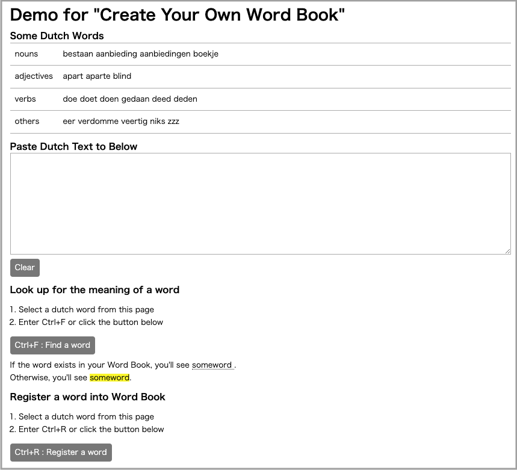
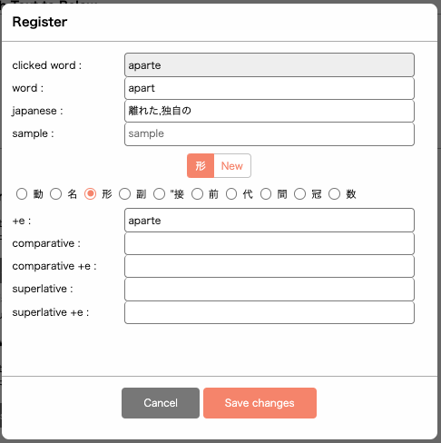
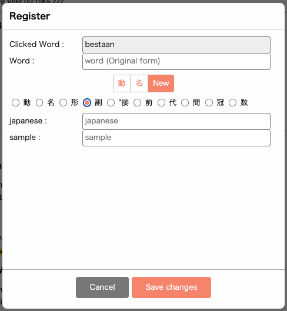

# Create Your Own Word Book

## What you can do with this App
  

1. Register word into your word book from your web site

(verb)  
  
  
(noun)  
  
  
(adjective)  
  
  
(other)  
  
  
1. Show meaning of a word in your website from your word book  


## Why I made this App
Currently I'm studying Dutch, and there is no digital Dutch-Japanese dictionary.  
So, I'm using Dutch-Japanese paper dictionary or  
Dutch-English && English-Japanese dictionary in my Mac PC.  
  
And also it's difficult to guess original form from conjugated Dutch word for beginner,  
such as

aangeboden --> aanbieden  
dofe --> doof  
golven --> golf  

So I decided to create my own Dutch-Japanese Word book online for myself.


## How to use Demo
```
git clone git@github.com:m-kanekawa/word_book.git
cd word_book
make upd
```
Then, access to 
http://localhost:10089/


## Add Word Book into your website

1. Create token and save it into "\<input type="hidden">" and SESSION['word_book_session_key'].
```php
<?php
session_start();
header('X-Frame-Options: DENY');
if (!isset($_SESSION['word_book_session_key'])) {
  $token = sha1(uniqid(rand(), true));
  $_SESSION['word_book_session_key'] = $token;
} else {
  $token = $_SESSION['word_book_session_key'];
}
?>

<input type="hidden" id="word_book_token" value="<?= $token ?>">
```

2. Add wordbook.css (bootstrap is also required)
```html
<link
  href="https://cdn.jsdelivr.net/npm/bootstrap@5.0.2/dist/css/bootstrap.min.css"
  rel="stylesheet"
  integrity="sha384-EVSTQN3/azprG1Anm3QDgpJLIm9Nao0Yz1ztcQTwFspd3yD65VohhpuuCOmLASjC"
  crossorigin="anonymous">
<link rel="stylesheet" href="./path_to_your_folder/wordbook.css">
```

3. Add wordbook_nl_jp.js (jquery is also required)
```html
<script
  src="https://code.jquery.com/jquery-3.7.1.min.js"
  integrity="sha256-/JqT3SQfawRcv/BIHPThkBvs0OEvtFFmqPF/lYI/Cxo="
  crossorigin="anonymous">
</script>
<script src="./path_to_your_folder/wordbook_nl_jp.js"></script>
```

4. Call 'init_word_book()'
```html
<script>
  init_word_book('word_book_token', 'tooltip');
</script>
```


> **function init_word_book(token_id, option)**  
> 
> **token_id (string)**  
> id for \<input type=hidden> which keeps a value of token
> 
> **option (string)**  
> "tooltip" or "ruby"  
> How to show the meaning of the word  


## Table Definition --for dutch--
| column  | part of speech | desc |
|---------|------|------|
| id      | all  | primary key | 
| type	  | all  | part of speech (*) | 　
| nl	    | all  | original form in dutch | 
| pre_ik	| verb | present tense (ik) | 
| pre_he	| verb | present tense (je/he) | 
| h_z		  | verb | hebben / zijn for present perfect tense | 
| pp	    | verb | past participle | 
| past_ik	| verb | past tense (ik) | 
| past_we	| verb | past tense (we) | 
| e	      | adjective | form for adjective end with e  | 
| de_het	| noun | de / het | 
| pl	    | noun | plural | 
| tje	    | noun | diminutive | 
| jp	    | all  | meaning (jp) | 
| sample  | all  | an example sentence | 

(*) I use these letters to distinguish part of speech.  
They're Japanese, but I decided to use them instead of verb, noun ...  
or separate table.


```
動: "verb",
名: "noun",
形: "adjective",
副: "adverb",
接: "conjunction",
前: "preposition",
代: "pronoun",
間: "interjection",
冠: "article",
数: "numeral",
```

## Apply for other launguages
### in case you want nl-xx wordbook
1. Add a new column or rename column "jp" in sqlite.
2. Copy wordbook_nl_jp.js into wordbook_nl-xx.js and replace all "jp" to "xx".
3. Copy api/v1.0/nl_jp/ to api/v1.0/nl-xx/ and do same as above.


### in case you want xx-yy wordbook
You need to redefine table definition.  
So you need to change everything.  

1. Copy wordbook_nl_jp.js into wordbook_xx_yy.js and modify it.
2. Copy api/v1.0/nl_jp/ to api/v1.0/xx_yy/ and modify all files in the folder.


## Sample data
In this repository, there is a "nl-jp.sqlite3" file, 
which includes about 2500 words.  
This file is **Private Use ONLY!!**  

If you want to start your nl-jp wordbook from scratch,
overwrite nl-jp.sqlite3 by nl-jp_empty.sqlite3.
